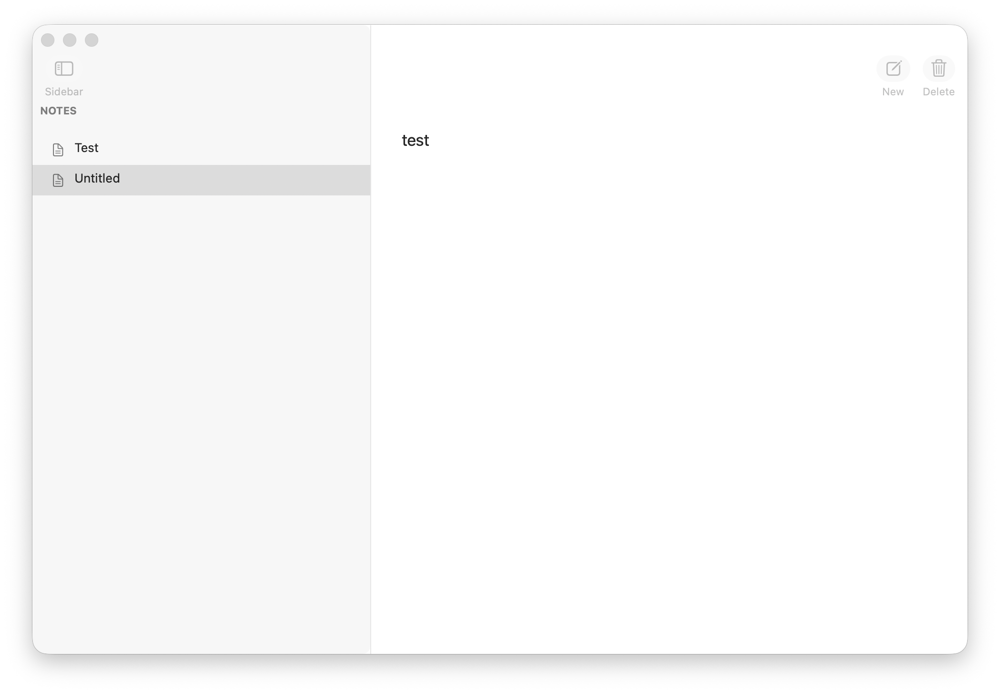

# Zig Notes

Zig Notes is a small native macOS notes app built with Zig and AppKit. It keeps the interface simple: a sidebar for your notes, a focused plain-text editor, and toolbar actions for creating, deleting, or hiding the note list.



## Features

- Native macOS window, toolbar, sidebar, and text editor.
- Plain-text notes saved as `.txt` files.
- Automatic note saving while you type.
- Editable note titles in the sidebar.
- New, delete, and sidebar-toggle actions from the toolbar.
- Local file storage in `~/Documents/Zig Notes`.

## Requirements

- macOS 13 or newer.
- Zig 0.16.0.

## Build and Run

Build the app bundle:

```sh
zig build
```

Launch the generated app:

```sh
open "zig-out/Zig Notes.app"
```

You can also launch it through Zig’s build graph:

```sh
zig build run
```

## Notes Storage

Zig Notes stores each note as a plain `.txt` file in:

```text
~/Documents/Zig Notes
```

This keeps your notes easy to inspect, back up, sync, or edit with other plain-text tools.

## Testing

Run the project tests with:

```sh
zig build test
```
